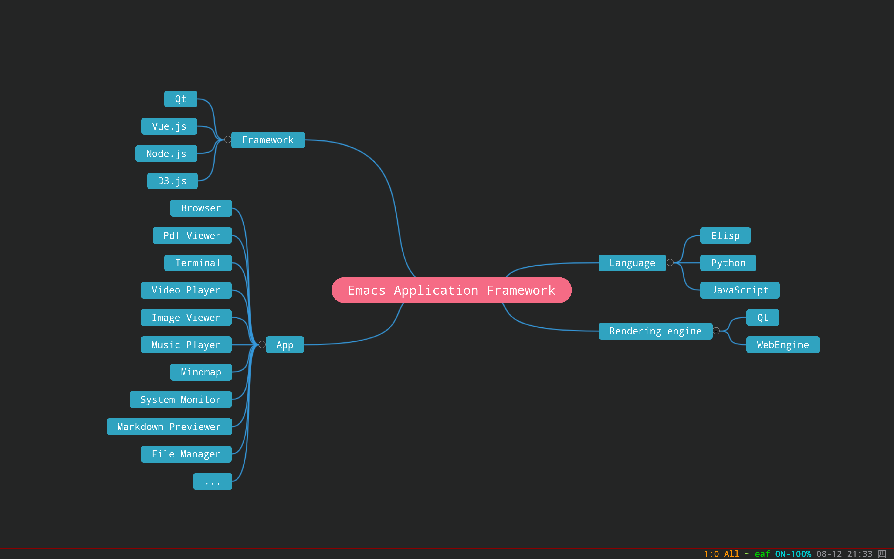

### EAF Mindmap
<p align="center">
  
</p>

Mindmap application for the [Emacs Application Framework](https://github.com/emacs-eaf/emacs-application-framework).

### Load application

```Elisp
(add-to-list 'load-path "~/.emacs.d/site-lisp/eaf-mindmap/")
(require 'eaf-mindmap)
```

### The keybinding of EAF Mindmap.

| Key   | Event   |
| :---- | :------ |
| `TAB` | add_sub_node |
| `RET` | add_brother_node |
| `<deletechar>` | remove_node |
| `M-m` | update_node_topic |
| `M-e` | update_node_topic_inline |
| `M-r` | refresh_page |
| `C--` | zoom_out |
| `C-=` | zoom_in |
| `C-0` | zoom_reset |
| `M-q` | add_multiple_sub_nodes |
| `M-RET` | add_multiple_brother_nodes |
| `M-i` | add_multiple_middle_nodes |
| `M-j` | select_down_node |
| `M-k` | select_up_node |
| `M-h` | select_left_node |
| `M-l` | select_right_node |
| `C-n` | eaf-send-down-key |
| `C-p` | eaf-send-up-key |
| `C-f` | eaf-send-right-key |
| `C-b` | eaf-send-left-key |
| `SPC` | insert_or_toggle_node_selection |
| `x` | insert_or_close_buffer |
| `j` | insert_or_select_down_node |
| `k` | insert_or_select_up_node |
| `h` | insert_or_select_left_node |
| `l` | insert_or_select_right_node |
| `w` | insert_or_copy_node_topic |
| `y` | insert_or_paste_node_topic |
| `W` | insert_or_cut_node_tree |
| `Y` | insert_or_paste_node_tree |
| `J` | insert_or_select_left_tab |
| `K` | insert_or_select_right_tab |
| `-` | insert_or_zoom_out |
| `=` | insert_or_zoom_in |
| `0` | insert_or_zoom_reset |
| `d` | insert_or_remove_node |
| `D` | insert_or_remove_middle_node |
| `i` | insert_or_add_middle_node |
| `f` | insert_or_update_node_topic |
| `t` | insert_or_toggle_node |
| `b` | insert_or_change_node_background |
| `c` | insert_or_change_background_color |
| `C` | insert_or_change_text_color |
| `1` | insert_or_save_screenshot |
| `2` | insert_or_save_file |
| `3` | insert_or_save_org_file |
| `4` | insert_or_save_freemind_file |
| `M-o` | eval_js |
| `M-O` | eval_js_file |
| `<f12>` | open_devtools |
